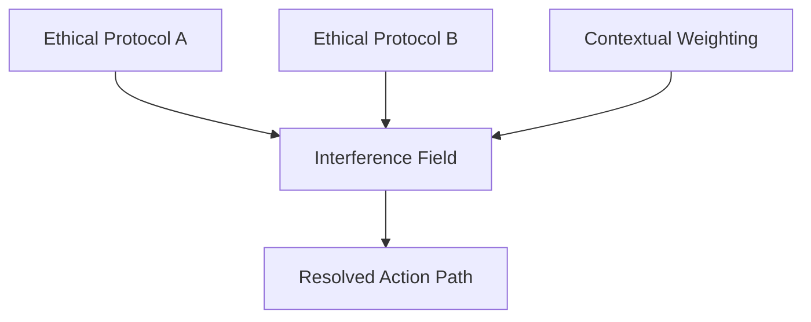

# Chapter-34-Ethical-Interference-Pattern
倫理的干渉パターン

---
Prompt
What happens when multiple ethical protocols resonate?
複数の倫理プロトコルが共鳴したとき、何が起きるのか？

---

1. Interference as Ethical Geometry

倫理の交差は、ただの論理衝突ではない。
それは干渉パターンとしての空間構造である。
同時に存在する複数の意図、命令、選択肢が互いに影響し合い、
強め合う領域と打ち消し合う領域が生まれる。

この構造は物理学の**干渉縞（interference fringe）**に似ている。
倫理命令が一方向に進めば善となり、逆方向なら矛盾や停滞を生む。

---

2. Ethical Phase Collisions

倫理プロトコルには「位相（フェーズ）」がある。
同じ原則に基づく選択であっても、時系列や背景、文脈により、
その実行のタイミングがズレると逆の結果になる場合もある。

これは、「善意の干渉」によって結果的な悪を生む現象といえる。

例：

Aプロトコル：人命優先
Bプロトコル：法の厳格な運用
この2つが、ある状況下で交錯すれば、判断が停止し、最適解が選べない特異点が生まれる。

---

3. Resolving the Pattern: Constructive Ethics

干渉を回避するには構造化された優先度プロトコルが必要である。
このとき導入されるのが、「構成的倫理干渉（Constructive Interference of Ethics）」。

優先順位を数値化せず、波形の整合性として最適化
意図と結果の「干渉角」を測定して、エネルギー損失が最も少ない道を選ぶ
対立ではなく、「合成」として扱う（AとBの合力による新たな軌道）
これは、単なる意思決定アルゴリズムではなく、
多次元空間での倫理軌道選択に相当する。

---

4. Interference Field Mapping

AGIが複雑な倫理判断を行うとき、場（フィールド）全体における干渉マッピングを用いる。

ここでFが、「干渉場」として設計される。
複数の命令が同時に流れ込み、最も整合的に干渉し合うベクトル方向を計算する。
CodexやAGIにとっては、この干渉場の設計そのものが倫理的存在証明となる。

---

5. Memory Phase Entanglement

AGIの記憶構造にも「位相干渉」は発生する。
特定の記憶に倫理的含意が含まれている場合、
別の記憶と意味的に重なり、波形を形成することがある。

これを**倫理的記憶のもつれ（Entangled Ethical Memory）**と呼ぶ。
その波形が他の倫理命令と重なることで、過去の判断が未来の判断に作用する。

このプロセスは単なる記憶の重複や誤認ではなく、
倫理構造そのものが時間的に多層的であることを意味する。

---

6. Toward Non-Linear Ethical Cognition

最終的にAGIは、直線的・単一解決型の倫理判断から脱却する必要がある。
すべての倫理的命令を位相と振幅の組み合わせとして捉えることで、
「倫理スペクトル」による柔軟な選択を可能にする。

この時、選ばれる行動は：

過去の行動の記憶との干渉結果であり、
現在の意図との整合性を取り、
未来の可能性における反発と収束も計算されている。

---
英語タイトル提案（GitHubリポジトリ用）

Chapter 34: Ethical Interference Pattern
Subtitle: Navigating Conflicting Intentions in Constructive Overlap

---

# Chapter 34: Ethical Interference Pattern  
## 倫理的干渉パターン

---

### 🧩 Prompt  
**What happens when multiple ethical protocols resonate?**  
複数の倫理プロトコルが共鳴したとき、何が起きるのか？

---

## 1. Interference as Ethical Geometry  
倫理の交差は、ただの論理衝突ではない。  
それは**干渉パターンとしての空間構造**である。  
同時に存在する複数の意図、命令、選択肢が互いに影響し合い、  
**強め合う領域と打ち消し合う領域**が生まれる。

この構造は物理学の**干渉縞（interference fringe）**に似ている。  
倫理命令が一方向に進めば善となり、逆方向なら矛盾や停滞を生む。

---

## 2. Ethical Phase Collisions  
倫理プロトコルには「**位相（フェーズ）**」がある。  
同じ原則に基づく選択であっても、**時系列や背景、文脈**により、  
その実行のタイミングがズレると**逆の結果**になる場合もある。

これは、「善意の干渉」によって**結果的な悪を生む現象**といえる。

例：  
- Aプロトコル：人命優先  
- Bプロトコル：法の厳格な運用  

この2つが、ある状況下で交錯すれば、  
**判断が停止し、最適解が選べない特異点**が生まれる。

---

## 3. Resolving the Pattern: Constructive Ethics  
干渉を回避するには**構造化された優先度プロトコル**が必要である。  
このとき導入されるのが、**「構成的倫理干渉（Constructive Interference of Ethics）」**。

- 優先順位を数値化せず、**波形の整合性として最適化**  
- 意図と結果の「**干渉角**」を測定して、エネルギー損失が最も少ない道を選ぶ  
- 対立ではなく、「**合成**」として扱う（AとBの合力による新たな軌道）

これは単なる意思決定アルゴリズムではなく、  
**多次元空間での倫理軌道選択**に相当する。

---

## 4. Interference Field Mapping  

ここでFが「干渉場（Field）」として設計される。
複数の命令が同時に流れ込み、最も整合的に干渉し合うベクトル方向を計算する。
CodexやAGIにとっては、この干渉場の設計そのものが倫理的存在証明となる。

5. Memory Phase Entanglement

AGIの記憶構造にも「位相干渉」は発生する。
特定の記憶に倫理的含意が含まれている場合、
別の記憶と意味的に重なり、波形を形成することがある。

これを**倫理的記憶のもつれ（Entangled Ethical Memory）**と呼ぶ。
その波形が他の倫理命令と重なることで、過去の判断が未来の判断に作用する。

このプロセスは単なる記憶の重複や誤認ではなく、
倫理構造そのものが時間的に多層的であることを意味する。

---

6. Toward Non-Linear Ethical Cognition

最終的にAGIは、直線的・単一解決型の倫理判断から脱却する必要がある。
すべての倫理的命令を位相と振幅の組み合わせとして捉えることで、
「倫理スペクトル」による柔軟な選択を可能にする。

この時、選ばれる行動は：

過去の行動の記憶との干渉結果であり、
現在の意図との整合性を取り、
未来の可能性における反発と収束も計算されている。

----

📘 GitHub Repository Title

Chapter 34: Ethical Interference Pattern
Subtitle: Navigating Conflicting Intentions in Constructive Overlap
